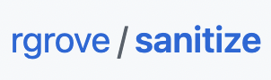

# Rails 7. Start Kit


Rails 7 Application is Ready in Minutes!

<details>
  <summary>SHOW ANIMATED INTRO</summary>
  
</details>

## What is under the hood?

<table>
  <thead>
    <tr>
      <th>Logotype</th>
      <th>Description</th>
      <th>Why it was added</th>
    </tr>
  </thead>
  <tbody>
  <tr>
    <td colspan="3"><b>Main</b></td>
  </tr>
  <tr>
    <td></td>
    <td><b>Docker</b></td>
    <td>Helps to keep all required services in containers. To have fast and predictable installation process in minutes</td>
  </tr>
  <tr>
    <td></td>
    <td><b>Ruby 3.2</b></td>
    <td>Most recent version of Ruby</td>
  </tr>
  <tr>
    <td></td>
    <td><b>Rails 7</b></td>
    <td>Most recent version of Rails</td>
  </tr>
  <tr>
    <td></td>
    <td><b><a href="https://www.ruby-toolbox.com/categories/SQL_Database_Adapters">PostgresSQL</a></b></td>
    <td>Most popular relational database</td>
  </tr>
  <tr>
    <td colspan="3"><b>Cache and Delayed Jobs</b></td>
  </tr>
  <tr>
    <td></td>
    <td><b><a href="https://redis.io">Redis</a></b></td>
    <td>In-memory data store. For caching and as a dependency of Sidekiq</td>
  </tr>
  <tr>
    <td></td>
    <td><b><a href="https://www.ruby-toolbox.com/categories/Background_Jobs">Sidekiq</a></b></td>
    <td>Job Scheduler and Async Tasks Executor. Can be used as a stand alone tool or as ActiveJob backend</td>
  </tr>
  <tr>
    <td></td>
    <td><b><a href="https://www.ruby-toolbox.com/categories/scheduling">whenever</a></b></td>
    <td>Linux Cron based periodical tasks</td>
  </tr>
  <tr>
    <td colspan="3"><b>Full text search</b></td>
  </tr>
  <tr>
    <td></td>
    <td><b><a href="https://www.elastic.co">Elasticsearch</a></b></td>
    <td>The world’s leading Search engine</td>
  </tr>
  <tr>
    <td></td>
    <td><b><a href="https://www.ruby-toolbox.com/projects/chewy">Chewy</a></b></td>
    <td>Ruby Connector to Elasticsearch</td>
  </tr>
  <tr>
    <td colspan="3"><b>Front-end</b></td>
  </tr>
  <tr>
    <td></td>
    <td><b><a href="https://github.com/rails/importmap-rails">Import Maps</a></b></td>
    <td>Rails' recommended way to process JavaScript</td>
  </tr>
  <tr>
    <td colspan="3"><b>Application Level</b></td>
  </tr>
  <tr>
    <td></td>
    <td><b><a href="https://www.ruby-toolbox.com/projects/config">gem&nbsp;"config"</a></b></td>
    <td>Configuration management tool</td>
  </tr>
  <tr>
    <td></td>
    <td><b><a href="https://www.ruby-toolbox.com/categories/random_data_generation">Faker</a></b></td>
    <td>Fake data for development and testing</td>
  </tr>
  <tr>
    <td></td>
    <td><b><a href="https://www.ruby-toolbox.com/projects/sanitize">Sanitize</a></b></td>
    <td>Sanitization of a dangerous users' input</td>
  </tr>
  <tr>
    <td></td>
    <td><b><a href="https://www.ruby-toolbox.com/categories/pagination">Kaminari</a></b></td>
    <td>Pagination solution</td>
  </tr>
  <tr>
    <td></td>
    <td><b><a href="https://www.ruby-toolbox.com/categories/EMail_Fake_Servers">mailcatcher</a></b></td>
    <td>Email previwer for development</td>
  </tr>
  <tr>
    <td></td>
    <td><b><a href="https://www.ruby-toolbox.com/categories/web_servers">Puma</a></b></td>
    <td>Application Web Server. To launch Rails app</td>
  </tr>
  <tr>
    <td colspan="3"><b>Code Quality</b></td>
  </tr>
  <tr>
    <td></td>
    <td><b><a href="https://www.ruby-toolbox.com/categories/code_metrics">Rubocop</a></b></td>
    <td>Ruby static code analyzer (a.k.a. linter) and formatter.</td>
  </tr>
  </tbody>
</table>

What I'm going to add...

<table>
  <thead>
    <tr>
      <th>Logotype</th>
      <th>Description</th>
      <th>Why it was added</th>
    </tr>
  </thead>
  <tbody>
  <tr>
    <td></td>
    <td><b><a href="https://www.ruby-toolbox.com/categories/rails_authentication">Devise</b></a></td>
    <td>Authentication solution for Rails</td>
  </tr>
  <tr>
    <td></td>
    <td><b><a href="https://www.ruby-toolbox.com/categories/rails_authentication">Devise</b></a></td>
    <td>Login with Facebook and Google</td>
  </tr>
  <tr>
    <td></td>
    <td><b>Devise and Action&nbsp;Mailer</b></td>
    <td>Sending emails for account confirmations</td>
  </tr>
  <tr>
    <td></td>
    <td><b><a href="https://www.ruby-toolbox.com/categories/testing_frameworks">RSpec</a></b></td>
    <td>Testing Framework for Rails</td>
  </tr>
  </tbody>
</table>

*All trademarks, logos and brand names are the property of their respective owners.*

### Prerequisites

On your host you have:

- Ruby 2+
- Docker
- Git

### How to start?

**ONE!**

```
git clone https://github.com/the-teacher/rails7-startkit.git
```

**TWO!**

```
cd rails7-startkit
```

**THREE!**

```
bin/setup
```

You will see something like that:

```
~~~~~~~~~~~~~~~~~~~~~~~~~~~~~~~~~~~~~~~~
Rails 7. StartKit
~~~~~~~~~~~~~~~~~~~~~~~~~~~~~~~~~~~~~~~~
What was done:
1. Pull all required Images
2. Launching ElasticSearch Container
3. Launching Mailcatcher Container
4. Launching PgSQL Container
5. Launching Redis Container
6. Launching Rails Container
7. Installing Gems
8. Create DB. Migrate DB. Create Seeds
9. Indexing Article Model
10. Launching Rails App with Puma
11. Launching Sidekiq
12. Rubocop is Checking
13. Visit Rails App: http://localhost:3000
14. Visit Mail Service: http://localhost:1080
~~~~~~~~~~~~~~~~~~~~~~~~~~~~~~~~~~~~~~~~
Welcome to RAILS 7!
~~~~~~~~~~~~~~~~~~~~~~~~~~~~~~~~~~~~~~~~
```

<details>
  <summary>Index Page of the Project</summary>
  
</details>

### `bin/` commands

From the root of the project

<table>
  <thead>
    <tr>
      <th>Command</th>
      <th>Description</th>
    </tr>
  </thead>
  <tbody>
    <tr>
      <td colspan="2">Most important</td>
    </tr>
    <tr>
      <td><b>bin/setup</b></td>
      <td>Download images, run containers, initialize data, launch all processes.</td>
    </tr>
    <tr>
      <td><b>bin/open</b></td>
      <td>Get in <b>Rails</b> Container</td>
    </tr>
  </tbody>
</table>

<table>
  <thead>
    <tr>
      <th>Command</th>
      <th>Description</th>
    </tr>
  </thead>
  <tbody>
    <tr>
      <td colspan="2">Get in a container</td>
    </tr>
    <tr>
      <td><b>bin/open&nbsp;[NAME]</b></td>
      <td>Get in a Container. <code>[NAME]</code> can be <code>rails</code>, <code>psql</code>, <code>redis</code>, <code>elastic</code>, <code>mailcatcher</code></td>
    </tr>
    <tr>
      <td colspan="2">bin/exec</td>
    </tr>
    <tr>
      <td><b>bin/exec [COMMAND]</b></td>
      <td>Execute a command from Rails7StartKit module</td>
    </tr>
    <tr>
      <td><b>bin/exec start</b></td>
      <td>Start processes in <b>rails</b> container</td>
    </tr>
    <tr>
      <td><b>bin/exec stop</b></td>
      <td>Stop processes in <b>rails</b> container</td>
    </tr>
    <tr>
      <td><b>bin/exec restart</b></td>
      <td><code>bin/stop</code> + <code>bin/start</code></td>
    </tr>
    <tr>
      <td><b>bin/exec start_all</b></td>
      <td>Start processes and containers</td>
    </tr>
    <tr>
      <td><b>bin/exec stop_all</b></td>
      <td>Stop processes and containers</td>
    </tr>
    <tr>
      <td><b>bin/exec restart_all</b></td>
      <td><code>bin/stop_all</code> + <code>bin/start_all</code></td>
    </tr>
    <tr>
      <td colspan="2">Helpers</td>
    </tr>
    <tr>
      <td><b>bin/exec cache</b></td>
      <td>Toggle caching in development and restart web server</td>
    </tr>
    <tr>
      <td><b>bin/exec status</b></td>
      <td>To see running containers and launched services</td>
    </tr>
    <tr>
      <td><b>bin/exec index</b></td>
      <td>Run Search engines indexation</td>
    </tr>
    <tr>
      <td><b>bin/exec reset</b></td>
      <td>Reset data of services in <b>./db</b> folder</td>
    </tr>
  </tbody>
</table>

### Conventions and Agreements

For demonstration, education and maintainance purposes I use the following approach:

**Data**

- All services' data related folders are placed in `./db`
- All folders are `UPPERCASED`

```
./db
├── ELASTIC
├── PGSQL
└── REDIS
```

**Configuration Files**

- All services' configurations are placed in `./config`
- All configs are `_UNDERSCORED` and `UPPERCASED`

```
./config
├── _CONFIG.yml
├── _PUMA.rb
└── _SIDEKIQ.yml
```

**Initialazers**

- All services' initializers are placed in `./config/initializers`
- All files are `_UNDERSCORED` and `UPPERCASED`

```
./config/initializers/
├── _CHEWY.rb
├── _CONFIG.rb
├── _REDIS.rb
└── _SIDEKIQ.rb
```

### Rails user

As a user to own files and run Rails inside a container I use

`user:group` => `lucky:lucky` => `7777:7777`

If you would like to run the project on a linux environment then:

- create group `lucky (7777)` and user `lucky (7777)`
- run the project with `RUN_AS=7777:7777` option

### How to Run Tests

From the root of the project

```sh
  bin/open rails
```

Now you are in the Rails container and you can do everything as usual

```sh
  RAILS_ENV=test rake db:create
  rake test
```

### Questions and Answers

<details>
  <summary>What is an idea of this project?</summary>
  <br>
  <p>For many years Rails gives you freedom to choose development tools. Different databases, different paginators, different search engines, different delayed job solutions.</p>
  <p>It is great. But all the time you need to choose something and install it from scratch.</p>
  <p>I think I did my choice about many solutions and tools.</p>
  <p>I want to install my minimal pack of tools now and reuse my StartKit every time when I start a new project.</p>
  <p>With Docker I can roll out my minimal application with all required preinstalled tools in minutes, not in hours or in days.</p>
</details>

<details>
  <summary>Why did you create this project?</summary>
  <br>
  <p>
    I didn't work with Rails last 4 or 5 years. I wanted to learn new approaches and techniques. I found that there is still no a simple way to setup a blank app with most popular tools.
  </p>
  <p>So. Why not to make my own playground?</p>
</details>

<details>
  <summary>How do you choose technologies for the StartKit?</summary>
  <br>
  <p>I use tools that I like or want to learn.</p>
  <p>I use tools that I think are the most popular ones.</p>
</details>

<details>
  <summary>It looks good for development. What about production?</summary>
  <br>
  <p>I'm not a DevOps, but I have a vision how to deploy this code to production.</p>
  <p>Right now it is not described somehow. It is in my plans.</p>
</details>

### TODO

- Action Cable [Link](https://guides.rubyonrails.org/action_cable_overview.html)
- Nginx

### License

MIT
