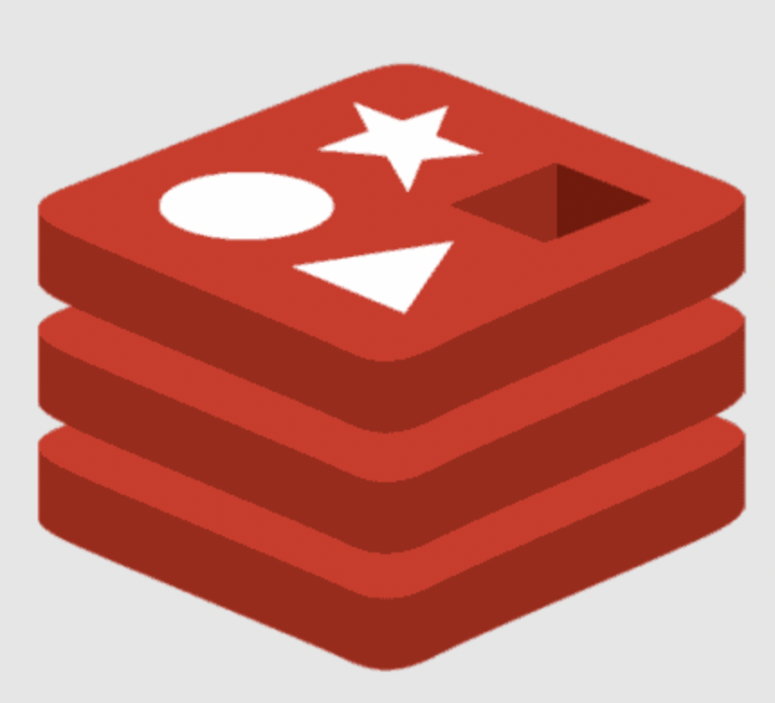

# Rails 7. Start Kit

Rails 7 App with Preinstalled Tools is Ready in Minutes!
## Why?

Usually It is difficult and time consuming to setup a typical Rails environment from scratch.

Since now if you have Ruby and Docker then you have working Rails environment in about 5 minutes without any manual efforts.
## What is under the hood?

<table>
  <thead>
    <tr>
      <td>Technology Logo</td>
      <td>Description</td>
      <td>Technology Logo</td>
      <td>Description</td>
    </tr>
  </thead>
  <tbody>
  <tr>
    <td></td>
    <td><b>Docker</b><br>Containerization for Services</td>
    <td></td>
    <td><b>PostgresSQL</b><br>Database</td>
  </tr>
  <tr>
    <td></td>
    <td><b>Ruby 3.2</b></td>
    <td></td>
    <td><b>Rails 7</b></td>
  </tr>
  <tr>
    <td></td>
    <td><b>Sphinx</b><br>Full Text Search Engine</td>
    <td></td>
    <td><b>Thinking Sphinx</b><br>Ruby Connector to Sphinx</td>
  </tr>
  <tr>
    <td></td>
    <td><b>Elasticsearch</b><br>The world’s leading Search engine</td>
    <td></td>
    <td><b>Chewy</b><br>Ruby Connector to Elasticsearch</td>
  </tr>
  <tr>
    <td></td>
    <td><b>Redis</b><br>In-memory data store for Caching</td>
    <td></td>
    <td><b>Sidekiq</b><br>Job Scheduler and Async Tasks Executor</td>
  </tr>
  <tr>
    <td></td>
    <td><b>Puma</b><br>Application Web Server</td>
    <td>New Things</td>
    <td>...Coming Soon</td>
  </tr>
  </tbody>
</table>

*All trademarks, logos and brand names are the property of their respective owners.*

### Prerequisites

On your host you have:

- Ruby 2+
- Docker
- Git

### How to start?

**ONE!**

```
git clone git@github.com:the-teacher/rails7-docker.git
```

**TWO!**

```
cd rails7-docker
```

**THREE!**

```
bin/setup
```

You will see something like that:

```
1. Launching PgSQL container
2. Launching Rails container
3. Installing Gems. Please Wait
4. Create DB. Migrate DB. Create Seeds
5. Launching Redis Container
6. Generate Sphinx Config
7. Launching Sphinx Container
8. Indexing Article Model
9. Launching Rails App with Puma
10. Launching Sidekiq
11. Visit: http://localhost:3000
```

### To Run All Containers

From the root of the project

```sh
bin/start
```

<details>
  <summary>Output</summary>

```sh
[+] Running 4/4
  ⠿ Container rails7app-redis-1   Running
  ⠿ Container rails7app-psql-1    Running
  ⠿ Container rails7app-sphinx-1  Running
  ⠿ Container rails7app-rails-1   Running
```
</details>

### To See Running Containers

From the root of the project

```sh
bin/status
```

<details>
  <summary>Output</summary>

```js
~~~~~~~~~~~~~~~~~~~~~~~~~~~~~~~~~~~~~~~~~~~~~~~~~~
NAMES                IMAGE                          PORTS                    CONTAINER ID
rails7app-rails-1    iamteacher/rails7:2023.arm64   0.0.0.0:3000->3000/tcp   1ed64ee7ca1c
rails7app-sphinx-1   macbre/sphinxsearch:3.4.1      36307/tcp                498ca21f4be3
rails7app-redis-1    redis:7.0.5-alpine             6379/tcp                 5bb16abc7ff8
rails7app-psql-1     postgres:15.1-bullseye         5432/tcp                 63669cc683c7
~~~~~~~~~~~~~~~~~~~~~~~~~~~~~~~~~~~~~~~~~~~~~~~~~~

docker compose -f docker/docker-compose.yml exec  rails /bin/bash -c 'ps a | grep puma'
   16 pts/1    Ssl+   0:01 puma 5.6.5 (tcp://0.0.0.0:3000) [app]
   33 pts/1    Sl+    0:01 puma: cluster worker 0: 16 [app]

docker compose -f docker/docker-compose.yml exec  rails /bin/bash -c 'ps a | grep sidekiq'
   23 pts/2    Ssl+   0:05 sidekiq 7.0.2 app [0 of 1 busy]
```
</details>

### To Get In a Container

**Rails**

```sh
bin/open rails
```

**PgSQL**

```sh
bin/open psql
```

**Redis**

```sh
bin/open redis
```

**Sphinx**

```sh
bin/open sphinx
```

### To Stop All Containers

From the root of the project

```sh
bin/stop
```

<details>
  <summary>Output</summary>

```sh
[+] Running 4/4
  ⠿ Container rails7app-redis-1   Removed
  ⠿ Container rails7app-psql-1    Removed
  ⠿ Container rails7app-sphinx-1  Removed
  ⠿ Container rails7app-rails-1   Removed
```
</details>

### Conventions and Agreements

For demonstration, education and maintainance purposes I use the following approach:

**Data**

- All services' data related folders are placed in `./db`
- All folders are `UPPERCASED`

```
./db
├── ELASTIC
├── PGSQL
├── REDIS
└── SPHINX
```

**Configuration Files**

- All services' configurations are placed in `./config`
- All configs are `_UNDERSCORED` and `UPPERCASED`

```
./config
├── _SPHINX (<< folder)
├── _CONFIG.yml
├── _PUMA.rb
├── _SIDEKIQ.yml
└── _THINKING_SPHINX.yml
```

**Initialazers**

- All services' initializers are placed in `./config/initializers`
- All files are `_UNDERSCORED` and `UPPERCASED`

```
./config/initializers/
├── _CHEWY.rb
├── _CONFIG.rb
├── _REDIS.rb
├── _SIDEKIQ.rb
└── _SPHINX.rb
```

### Rails user

As a user to own files and run Rails inside a container I use

`user:group` => `lucky:lucky` => `7777:7777`

If you would like to run the project on a linux environment then:

- create group `lucky (7777)` and user `lucky (7777)`
- run the project with `RUN_AS=7777:7777` option

### How to Run Tests

From the root of the project

```sh
  bin/open rails
```

Now you are in the Rails container and you can do everything as usual

```sh
  RAILS_ENV=test rake db:create
  rake db:test
```

### Questions and Answers

<details>
  <summary>Why did you create this project?</summary>
  <br>
  <p>
  I didn't work with Rails last 4 or 5 years. I wanted to learn new approaches and tecniques. I found that there is still no a simple way to setup a blank app with most popular tools.
  </p>
  <p>So. Why not to make my own playground?</p>
</details>

<details>
  <summary>How do you choose technologies for the StartKit?</summary>
  <br>
  <p>I use tools that I like or want to learn.</p>
  <p>I use tools that I think are the most popular ones.</p>
</details>

<details>
  <summary>It looks good for development. What about production?</summary>
  <br>
  <p>I'm not a DevOps, but I have a vision how to deploy this code to production.</p>
  <p>Right not it is not described somehow. It is in my plans.</p>
</details>

<details>
  <summary>Why did you use 2 Search engines in this project?</summary>
  <br>
  <p>
    Sphinx is a tool what I know. ElasticSearch I'm going to learn.
    If you do not need one of them it is not a problem.
  </p>
  <p>It is always easier to cut off than install and set up.</p>
</details>

### TODO

- <s>ElasticSearch. [Chewy](https://github.com/toptal/chewy)</s>
- <s>Memcached [Link](https://devcenter.heroku.com/articles/building-a-rails-3-application-with-memcache)</s> [Rejected](https://stackoverflow.com/questions/10558465/memcached-vs-redis)
- <s>Puma on systemd [Link](https://github.com/puma/puma/blob/master/docs/systemd.md)</s> [Rejected](https://developers.redhat.com/blog/2019/04/24/how-to-run-systemd-in-a-container)
- <s>Sidekiq on systemd [Link](https://github.com/mperham/sidekiq/blob/main/examples/systemd/sidekiq.service)</s> [Rejected](https://developers.redhat.com/blog/2019/04/24/how-to-run-systemd-in-a-container)
- Action Cable [Link](https://guides.rubyonrails.org/action_cable_overview.html)
- Nginx

### License

MIT
